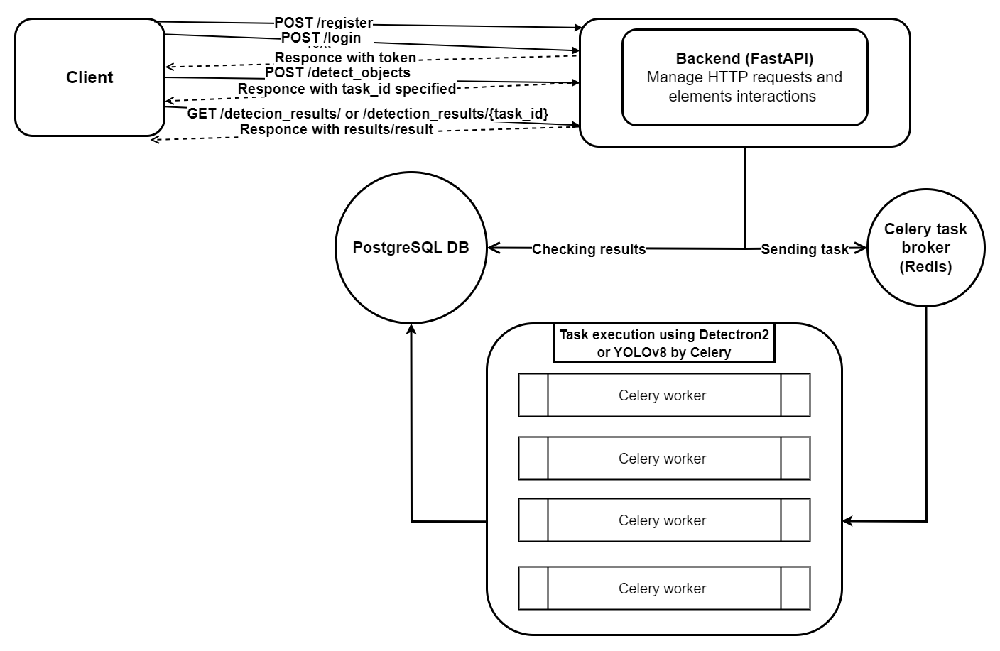
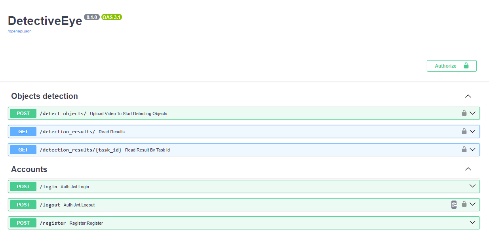

# DetectiveEye 
___
#### API for detecting objects on video and returning understandable results. Users are required to register and log in to access the API's functionality.To initiate object detection on video, user upload MP4 video file, choose ObjectsDetector and receives DetectionResult instance with status Processing and task_id mentioned. Object detection is handling in background and user can check status using task_id.  
___

<div> <a href="https://www.loom.com/share/7d82ea6168e64248b4d7abfaae0d7012"> <p>Watch Video Presentation</p> </a> <a href="https://www.loom.com/share/7d82ea6168e64248b4d7abfaae0d7012">  </a> </div>

# Project Architecture


## 🔧 Technologies used:
___
* [X] **FastAPI** - is employed for handling HTTP requests and responses, as well as project elements interactions.
* [X] **PostgreSQL** - reliable SQL-database for Users and DetectionResult data storage.
* [X] **Celery** - task management system to handle object detection and DetectionResults update in a background.
* [X] **Redis** - message broker for Celery.
* [X] **Facebook** Detectron2 and Ultralytics YOLOv8 - open source projects for object detection.
* [X] **OpenCV** - used as tool for video processing and splitting into frames. 
* [X] **Docker** - for project containerization and running it independently of file-system.
___
#### 🗝 ENDPOINTS:  
#### Note that only authenticated users can detect objects on video and see own results

- **User creating** - POST request to `/register/`
- **Login** - POST request to `/login/`
- **Logout** - POST request to `/logout/`

- **Start objects detection by uploading video file** - POST request to `/detect_objects/` 
- **See all detection result** - GET request to `/detection_results/`
- **See single detection result by {task_id}** - GET request `/detection_results/{task_id}`

### 💾 Installation:
___
#### 1. Clone the repository:
```shell
git clone https://github.com/BohdanYatsyna/DetectiveEye.git
cd DetectiveEye
```
#### 2. Create and activate virtual environment with requirements install:
🖥 Windows:
```shell
python -m venv venv
venv\Scripts\activate
```
💻 Linux/MacOS:
```shell
python -m venv venv
source venv/bin/activate
```
#### 3. 🗝 Set up environment variables (using .env):
- Create an empty .env file in the root folder of the project.
- Copy the entire content of the .env.sample to your .env file.
- Modify the placeholders in the .env file with your preferable environment variables.
- Modify file ./alembic.ini line 63 ('sqlalchemy.url = postgresql://POSTGRES:PASSWORD@db/postgres') in accordance with .env variables to pass db migrations with ease.

#### 4. 🐳 Run it with DOCKER:
- DOCKER should be installed and opened.
```shell
docker-compose up --build
```
- And open in your browser "http://127.0.0.1:8000/docs/"

#### 🗝 Important note.
#### For using GPU (CUDA support required) with Detectron2 and YOLOv8 update next:
-         Add to .env 'ENV_DETECTRON2_DEVICE=gpu' and 'ENV_YOLOv8_DEVICE=gpu'
-         Replace in ./Dockerfile "pip install torch torchvision torchaudio --index-url https://download.pytorch.org/whl/cpu" with "pip3 install torch torchvision torchaudio"

# 🕶 DEMO
### Documentation with all endpoints:

